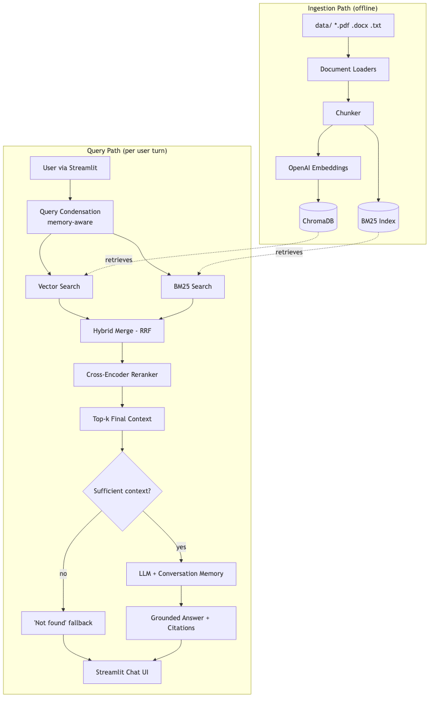

# Employee Knowledge Assistant — Advanced RAG

IIT Patna USDC GenAI Development Program — Final Capstone (Project 2: Enterprise
Knowledge Assistant with Advanced RAG).

## Problem Statement

Employees waste time hunting through scattered policy PDFs/DOCXs for answers to common
questions (leave entitlement, VPN reset steps, travel reimbursement rules, etc.). A basic
"chat with PDF" bot is easy to build but easy to fool into hallucinating or losing track
of a conversation. This project builds a **production-oriented** RAG assistant that goes
past that baseline: hybrid retrieval, reranking, real conversational memory, grounded
citations, and an explicit refusal path when the answer genuinely isn't in the corpus.

## Solution Overview

A Streamlit chat app answers employee questions from a local set of company policy
documents. Every question is retrieved via **both** vector search and BM25 keyword
search, fused with **Reciprocal Rank Fusion**, reranked with a local cross-encoder, and
only then answered by an LLM — grounded strictly in that retrieved context, with cited
sources. Follow-up questions are resolved against recent chat history before retrieval
runs, so "what about carry-forward?" correctly means "what about leave carry-forward?".
If the retrieved context is too weak to answer from, the app says so instead of guessing.

## Architecture



See [`docs/HLD.md`](docs/HLD.md) for the high-level design and key decisions, and
[`docs/LLD.md`](docs/LLD.md) for module-by-module detail.

## Technology Stack

| Layer | Choice |
|---|---|
| LLM | OpenAI `gpt-4o-mini` |
| Embeddings | OpenAI `text-embedding-3-small` |
| Vector store | ChromaDB (persisted locally) |
| Keyword search | BM25 (`rank_bm25`) |
| Reranker | Local cross-encoder (`sentence-transformers`, `cross-encoder/ms-marco-MiniLM-L-6-v2`) |
| Orchestration / memory | LangChain |
| UI | Streamlit |
| Package management | `uv` |

## Project Structure

```
knowledge-assistant/
├── docs/            HLD, LLD, evaluation strategy, logging design, architecture diagram
├── data/            sample policy documents (PDF/DOCX/TXT)
├── eval/            eval question set + retrieval/generation/report scripts
├── src/             ingestion, retrieval, memory, generation, guardrails, config, logging
├── app/             Streamlit UI
├── scripts/         build_index.py, generate_sample_data.py
├── tests/           unit tests for chunking, fusion, guardrails, metrics
└── logs/            runtime logs (gitignored)
```

## Setup Instructions

Requires Python 3.11–3.12 and [`uv`](https://docs.astral.sh/uv/).

```bash
cd knowledge-assistant
uv sync                       # installs all dependencies into .venv
cp .env.example .env          # then edit .env and set OPENAI_API_KEY
```

### Environment Variables

See [`.env.example`](.env.example) for the full list. Only `OPENAI_API_KEY` is required;
everything else has a sensible default from `src/config.py`.

| Variable | Required | Default |
|---|---|---|
| `OPENAI_API_KEY` | Yes | — |
| `LLM_MODEL` | No | `gpt-4o-mini` |
| `EMBEDDING_MODEL` | No | `text-embedding-3-small` |
| `TOP_K_VECTOR` / `TOP_K_BM25` / `TOP_K_RERANK` | No | `10` / `10` / `4` |
| `CHUNK_SIZE` / `CHUNK_OVERLAP` | No | `400` / `80` |
| `EVAL_TOP_K` | No | `4` |
| `LOG_LEVEL` | No | `INFO` |

## How to Run

```bash
# 1. (Optional) regenerate the sample policy documents in data/
uv run python -m scripts.generate_sample_data

# 2. Build the vector + BM25 indexes from data/
uv run python -m scripts.build_index

# 3. Launch the app
uv run streamlit run app/streamlit_app.py
```

The app also has a "(Re)build index from data/" button in the sidebar, so re-indexing
after adding new documents doesn't require the CLI.

### Running the evaluation suite

```bash
uv run python -m eval.run_retrieval_eval     # Hit Rate / MRR: vector vs BM25 vs hybrid+rerank
uv run python -m eval.run_generation_eval    # faithfulness, relevancy, refusal accuracy, memory
uv run python -m eval.build_report           # writes the combined eval/report.md
```

See [`docs/EVALUATION.md`](docs/EVALUATION.md) for what each metric means.

The eval calls the OpenAI API. The unit tests do not, and run in seconds:

```bash
uv run pytest
```

## Sample Inputs / Outputs

Sample data lives in `data/` (Leave, IT, Travel, Remote Work, Performance, and Employee
Handbook policies + a Company FAQ, spanning PDF/DOCX/TXT). Example interaction:

```
User: How do I reset my VPN password?
Assistant: Open the IT Service Portal, select 'Password Reset', choose 'VPN Account',
and verify your identity using your registered employee email and two-factor
authentication code. The new password takes effect immediately...
Sources: IT_Policy.docx

User: What if the automated reset fails?
Assistant: If the automated reset fails twice, raise a support ticket with the IT
Helpdesk for a manual reset.
Sources: IT_Policy.docx

User: Does the company offer a sabbatical leave program?
Assistant: I could not find this information in the available documents.
```

`eval/eval_questions.jsonl` contains 18 curated test questions (answerable, deliberately
unanswerable, and multi-turn) used to produce `eval/report.md`.

## Key Design Decisions

- **Reciprocal Rank Fusion**, not score averaging, to combine vector + BM25 results —
  their raw scores aren't on comparable scales.
- **Local cross-encoder reranker** rather than a hosted reranking API, to avoid a second
  paid dependency.
- **Citations are derived from the chunks actually fed to the LLM**, not parsed from the
  model's own output — more reliable, can't be hallucinated.
- **Two-stage hallucination guardrail**: a cheap pre-generation relevance-score check
  (skips the LLM call entirely when context is clearly insufficient) plus a
  post-generation self-refusal check — see `docs/HLD.md` §4 for the full rationale.
- **Structured JSON logging with per-query IDs** so a single question's pipeline trace is
  greppable end to end — see `docs/LOGGING.md`.

## Limitations

- Query condensation adds one extra LLM round-trip per follow-up turn (latency/cost
  trade-off, made in exchange for correctness on pronoun/implicit-reference follow-ups).
- The local cross-encoder reranker is CPU-bound and is typically the slowest single stage.
- No incremental indexing — `build_index()` does a full rebuild every run, which is fine
  at this corpus size but wouldn't scale to a large enterprise document set as-is.
- The LLM-judge used in `eval/run_generation_eval.py` is itself an LLM call and should be
  read as directional signal, not ground truth (see `docs/EVALUATION.md` §6).
